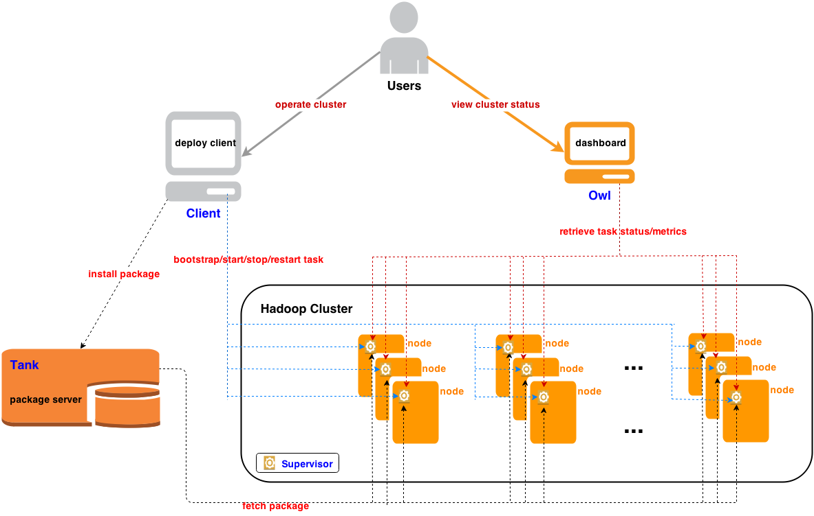

</img>

# What is Minos

Minos is a distributed deployment and monitoring system.  It was initially developed and used at [Xiaomi](http://www.xiaomi.com) to deploy and manage the Hadoop, HBase and ZooKeeper clusters used in the company.  Minos can be easily extended to support other systems, among which HDFS, YARN and Impala have been supported in the current release.

# Components

The Minos system contains the following four components:

1. Client
2. Owl
3. Supervisor
4. Tank

</img>

## Client

This is the command line client tool used to deploy and manage processes of various systems. You can use this client to perform various deployment tasks, e.g. installing, (re)starting, stopping a service.  Currently, this client supports ZooKeeper, HDFS, HBase, YARN and Impala.  It can be extended to support other systems. You can refer to the following `Using Client` to learn how to use it.

## Owl

This is the dashboard system to display the status of all processes, where users can take a overview of the whole clusters managed by Minos. It collects data from servers through JMX interface. And it organizes pages in cluster, job and task corresponding to the definition in cluster configuration. It also provides some utils like health alerter, HDFS quota updater and quota reportor. You can refer to `Installing Owl` to learn how to install and use it.

## Supervisor

This is the process management and monitoring system. [Supervisor](http://supervisord.org/) is an open source project, a client/server system that allows its users to monitor and control a number of processes on a UNIX-like operating system.

Based on the version of supervisor-3.0b1, we extended Supervisor to support Minos. We implemented an RPC interface under the `deployment` directory, so that our deploy client can invoke the services supplied by supervisord.

When deploying a Hadoop cluster for the first time, you need to set up `supervisord` on every production machine. This only needs to be done once. You can refer to `Installing Supervisor` to learn how to install and use it.

## Tank

This is a simple package management Django app server for our deployment tool. When setting up a cluster for the first time, you should set up a tank server first. This also needs to be done only once. You can refer to `Installing Tank` to learn how to install and use it.

# Setting Up Minos on Centos/Ubuntu

## Prerequisites

### Install Python

Make sure install Python 2.7 or later from source <http://www.python.org>. Using package management tool such as `yum` may get a lower version.

### Install JDK

Make sure that the Oracle Java Development Kit 6 is installed (not OpenJDK) from <http://www.oracle.com/technetwork/java/javase/downloads/index.html>, and that `JAVA_HOME` is set in your environment.

## Clone the Minos repository

To Using Minos, just check out the code on your production machine:

    git clone https://github.com/XiaoMi/minos.git

## Building Minos

All the Components of Minos run with its own virtual environment. So, before using Minos, building the virtual environment firstly.

    cd minos
    ./build.sh build

Note: If you only use the Client component, this operation is enough. Then you can refer to `Using Client` to learn how to deploy and manage a cluster; If you want to use the current computer as the Tank server, you can refer to `Installing Tank` to start it; Alternatively, if you want to setup a Supervisor or Owl in your computer, then refer to `Installing Supervisor` and `Installing Owl` respectively.

## Installing Tank

### Run Tank

    cd minos
    ./build.sh start tank --tank_ip x.x.x.x --tank_port xxx

If you do not specify the `tank_ip` and `tank_port`, it will start tank server using `0.0.0.0` on `8000` port.

Note: When you start a specified component, it will check the environment and build the prerequisites firstly and then start the boot program. This will take some time, especially the first time you start it.

### Stop Tank

    ./build.sh stop tank

### Directories

    data/: the data directory used to store the packages
    package_server/: the package server django app directory
    sqlite/: the sqlite database directory
    static/: the static resources directory
    tank/: the main django directory
    templates/: the web page template directory

## Installing Supervisor

### Prerequisites

Make sure you have intstalled `Tank` on some production machine.

### Run Supervisor

    cd minos
    ./build.sh start supervisor --tank_ip x.x.x.x --tank_port xxx

When starting supervisor for the first time, the `tank_ip` and `tank_port` must be specified. It will notify supervisord the address of package server.

After starting supervisor on the destination machine, you can access the web interface of the supervisord.  For example, suppose the default port is 9001, and the production machine's ip is 192.168.1.11, you can access the following URL to view the processes managed by supervisord:

    http://192.168.1.11:9001/

Note: If you are not the first time to start supervisor on the machine, there is no need to specify the arguments `tank_ip` and `tank_port`.

### Stop Supervisor

    ./build.sh stop supervisor

### Superlance

[Superlance](https://pypi.python.org/pypi/superlance) is a package of plug-in utilities for monitoring and controlling processes that run under supervisor.

We integrate `superlance-0.7` to our supervisor system, and use the crashmail tool to monitor all processes.  When a process exits unexpectedly, crashmail will send an alert email to a mailing list that is configurable.

We configure crashmail as an auto-started process.  It will start working automatically when the supervisor is started.  Following is a config example, taken from `minos/build/template/supervisord.conf.tmpl`, that shows how to configure crashmail:

    [eventlistener:crashmailbatch-monitor]
    command=python superlance/crashmailbatch.py \
            --toEmail="alert@example.com" \
            --fromEmail="robot@example.com" \
            --password="123456" \
            --smtpHost="mail.example.com" \
            --tickEvent=TICK_5 \
            --interval=0.5
    events=PROCESS_STATE,TICK_5
    buffer_size=100
    stdout_logfile=crashmailbatch.stdout
    stderr_logfile=crashmailbatch.stderr
    autostart=true

Note: The related configuration information such as the server `port` or `username` is set in `minos/build/template/supervisord.conf.tmpl`, if you don't want to use the default value, change it.

## Using Client

### Prerequisites

Make sure you have intstalled `Tank` and `Supervisor` on your production machines.

### A Simple Tutorial

Here we would like to show you how to use the client in a simple tutorial.  In this tutorial we will use Minos to deploy an HDFS service, which itself requires the deployment of a ZooKeeper service.

The following are some conventions we will use in this tutorial:

* **Cluster type**: we define three types of clusters: `tst` for testing, `prc` for offline processing, and `srv` for online serving.
* **ZooKeeper cluster name**: we define the ZooKeeper cluster name using the IDC short name and the cluster type.  For example, `dptst` is used to name a testing cluster at IDC `dp`.
* **Other service cluster names**: we define other service cluster names using the corresponding ZooKeeper cluster name and the name of the business for which the service is intended to serve.  For example, the `dptst-example` is the name of a testing cluster used to do example tests.
* **Configuration file names**: all the services will have a corresponding configuration file, which will be named as `${service}-${cluster}.cfg`.  For example, the `dptst` ZooKeeper service's configuration file is named as `zookeeper-dptst.cfg`, and the `dptst` example HDFS service's configuration file is named as `hdfs-dptst-example.cfg`.

#### Configuring `deploy.cfg`

There is a configuration file named `deploy.cfg` under the root directory of minos.  You should first edit this file to set up the deployment environment.  Make sure that all service packages are prepared and configured in `deploy.cfg`.

#### Configuring ZooKeeper

As mentioned in the cluster naming conventions, we will set up a testing ZooKeeper cluster at the `dp` IDC, and the corresponding configuration file for the cluster will be named as `zookeeper-dptst.cfg`.

You can edit `zookeeper-dptst.cfg` under the `config/conf/zookeeper` directory to configure the cluster.  The `zookeeper-dptst.cfg` is well commented and self explained, so we will not explain more here.

#### Setting up a ZooKeeper Cluster
To set up a ZooKeeper cluster, just do the following two steps:

* Install a ZooKeeper package to the tank server:

        cd minos/client
        ./deploy.sh install zookeeper dptst

* Bootstrap the cluster, this is only needed once when the cluster is setup for the first time:

        ./deploy.sh bootstrap zookeeper dptst

Here are some handy ways to manage the cluster:

* Show the status of the ZooKeeper service:

        ./deploy.sh show zookeeper dptst

* Start/Stop/Restart the ZooKeeper cluster:

        ./deploy.sh stop zookeeper dptst
        ./deploy.sh start zookeeper dptst
        ./deploy.sh restart zookeeper dptst

* Clean up the ZooKeeper cluster:

        ./deploy.sh cleanup zookeeper dptst

* Rolling update the ZooKeeper cluster:

        ./deploy.sh rolling_update zookeeper dptst

#### Configuring HDFS

Now it is time to configure the HDFS system.  Here we set up a testing HDFS cluster named `dptst-example`, whose configuration file will be named as `hdfs-dptst-example.cfg`, as explained in the naming conventions.

You can edit `hdfs-dptst-example.cfg` under the `config/conf/hdfs` directory to configure the cluster.  The `hdfs-dptst-example.cfg` is well commented and self explained, so we will net explain more here.

#### Setting Up HDFS Cluster

Setting up and managing an HDFS cluster is similar to setting up and managing a ZooKeeper cluster.  The only difference is the cluster name, `dptst-example`, which implies that the corresponding ZooKeeper cluster is `dptst`:

    ./deploy.sh install hdfs dptst-example
    ./deploy.sh bootstrap hdfs dptst-example
    ./deploy.sh show hdfs dptst-example
    ./deploy.sh stop hdfs dptst-example
    ./deploy.sh start hdfs dptst-example
    ./deploy.sh restart hdfs dptst-example
    ./deploy.sh rolling_update hdfs dptst-example --job=datanode
    ./deploy.sh cleanup hdfs dptst-example

#### Shell

The client tool also supports a very handy command named `shell`.  You can use this command to manage the files on HDFS, tables on HBase, jobs on YARN, etc.  Here are some examples about how to use the `shell` command to perform several different HDFS operations:

    ./deploy.sh shell hdfs dptst-example dfs -ls /
    ./deploy.sh shell hdfs dptst-example dfs -mkdir /test
    ./deploy.sh shell hdfs dptst-example dfs -rm -R /test
You can run `./deploy.sh --help` to see the detailed help messages.

## Installing Owl

### Prerequisites

#### Install Gnuplot

Gnuplot is required for opentsdb, you can install it with the following command.

    Centos: sudo yum install gnuplot
    Ubuntu: sudo apt-get install gnuplot

#### Install Mysql

    Ubuntu:
    sudo apt-get install mysql-server
    sudo apt-get install mysql-client

    Centos:
    yum install mysql-server mysql mysql-devel

### Configuration

Configure the clusters you want to monitor with owl in `minos/config/owl/collector.cfg`. Following is an example that shows how to modify the configuration.

    [collector]
    # service name(space seperated)
    service = hdfs hbase

    [hdfs]
    # cluster name(space seperated)
    clusters=dptst-example
    # job name(space seperated)
    jobs=journalnode namenode datanode
    # url for collecotr, usually JMX url
    metric_url=/jmx?qry=Hadoop:*

Note: Some other configurations such as `owl monitor http port` and `opentsdb port` are set in `minos/build/minos_config.py`. You can change the default port for port conflicts.

### Run Owl

    cd minos
    ./build.sh start owl --local_ip x.x.x.x

When starting owl, the argument `local_ip` is necessary especially you have multiple network cards. The `local_ip` will be used for making opentsdb address. Actually, if you chose to use a remote mysql server, it also would be used to set access for owl database.

After starting Owl on the destination machine, you can access the web interface of the Owl.  For example, suppose the default port is 8088, and the machine's ip is 192.168.1.11, you can access the following URL to view the processes monitored by Owl:

    http://192.168.1.11:8088/

Note: If you want to monitor the quota status, you can start owl with `--quota_updater`.

### Stop Owl.

    ./build.sh stop owl

### Attention

All the arguments need to specify are required for building the component when you firstly start one. After that, there is no longer required whenever you start/stop it.

### Using a real HBase cluster in Owl

If you want to use a real hbase cluster, you can build and start owl with `--skip_setup_hbase` to skip setup the default stand-alone hbase. Besides, some other work needs to do for deploying your opentsdb.

#### Create hbase table

    cd minos/build/download/opentsdb
    env COMPRESSION=NONE HBASE_HOME=path/to/hbase-cluster ./src/create_table.sh

In regard to the path to your real hbase-cluster, you can use the Client component to pack a usable package such as:

    cd minos/client
    ./deploy.sh pack hbase $hbase_cluster_name

Then the usable hbase package would be generated at `client/packages/`

#### Start the opentsdb

    cd minos/build/download/opentsdb
    tsdtmp=${TMPDIR-'/tmp'}/tsd
    mkdir -p "$tsdtmp"
    nohup ./build/tsdb tsd --port=4242 --staticroot=build/staticroot --cachedir="$tsdtmp" --zkquorum="$your_zookeeper_quorum" --zkbasedir="/hbase/$hbase_cluster_name" 1>opentsdb.out 2>&1 &

The `zkquorum` is a comma-separated list of hosts serving your zookeeper quorum just like `ip1:port,ip2:port,ip3:port`.

#### Start opentsdb collector

    cd minos/config/opentsdb
    vim metrics_collector_config.py
    $opentsdb_extra_args = '--zkquorum=xxx --zkbasedir=xxx'
    cd ../../opentsdb
    nohup ./collector.sh &

# FAQ

1. When installing Mysql-python, you may get an error of "_mysql.c:44:23: error: my_config.h: No such file or directory (centos)" or "EnvironmentError: mysql_config not found (ubuntu)". As mysql_config is part of mysql-devel, installing mysql-devel allows the installation of Mysql-python. So you may need to install it.

        ubuntu: sudo apt-get install libmysqlclient-dev
        centos: sudo yum install mysql-devel

2. When installing twisted, you may get an error of "CompressionError: bz2 module is not available" and compile appears:

        Python build finished, but the necessary bits to build these modules were not found:
        _sqlite3           _tkinter           bsddb185
        bz2                dbm                dl

  Then, you may need to install bz2 and sqlite3 such as

        sudo apt-get install libbz2-dev
        sudo apt-get install libsqlite3-dev

3. When setting up the stand-alone hbase on Ubuntu, you may fail to start it because of the `/etc/hosts` file. You can refer to <http://hbase.apache.org/book/quickstart.html#ftn.d2907e114> to fix the problem.

4. When using the Minos client to install a service package, if you get an error of "socket.error: [Errno 101] Network is unreachable", please check your tank server configuration in `deploy.cfg` file, you might miss it.
